# MedSync AI v2 — System Architecture

## High-Level Pipeline

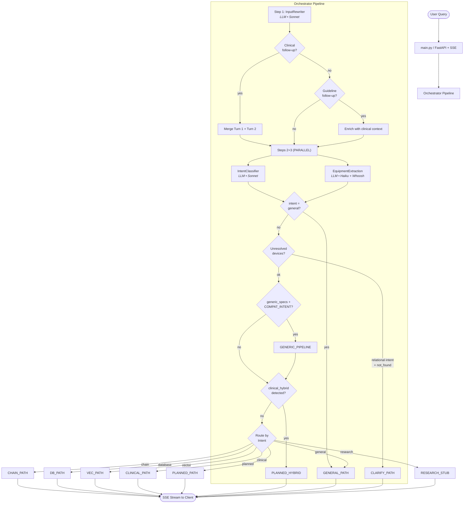

## Intent Classification & Routing

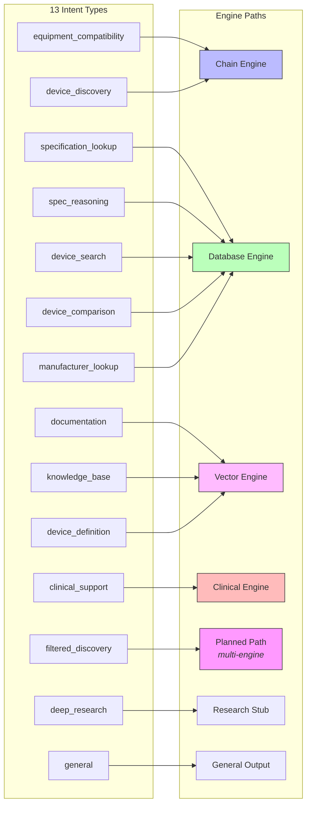

## Chain Engine (Compatibility)

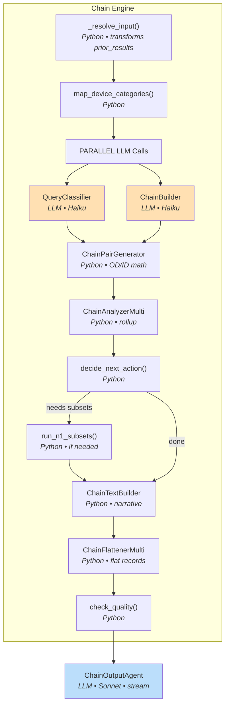

## Database Engine (Specs, Search, Comparison)

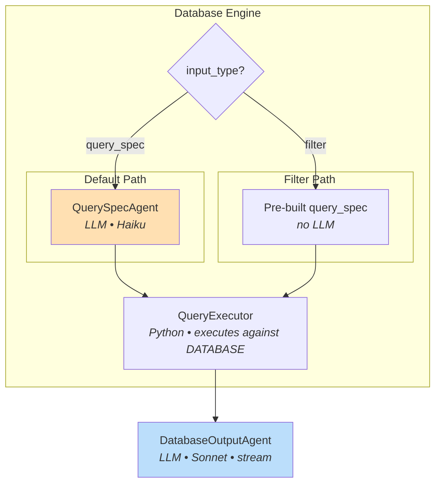

## Vector Engine (IFU / 510k Documents)

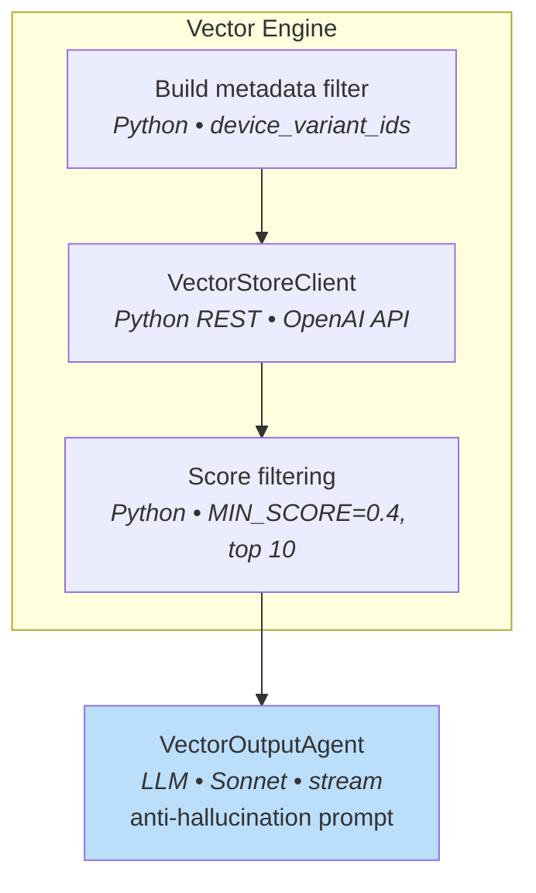

## Clinical Support Engine (AIS Eligibility)

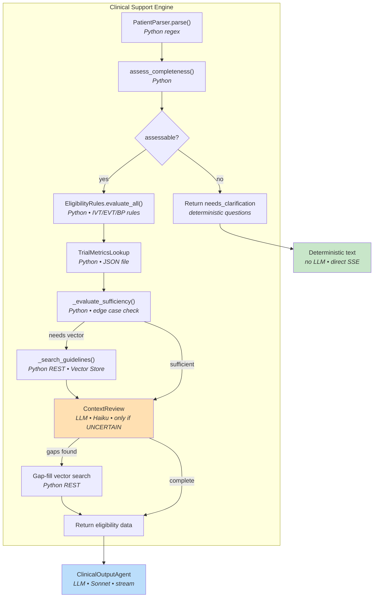

## Planned Path (Multi-Engine Orchestration)

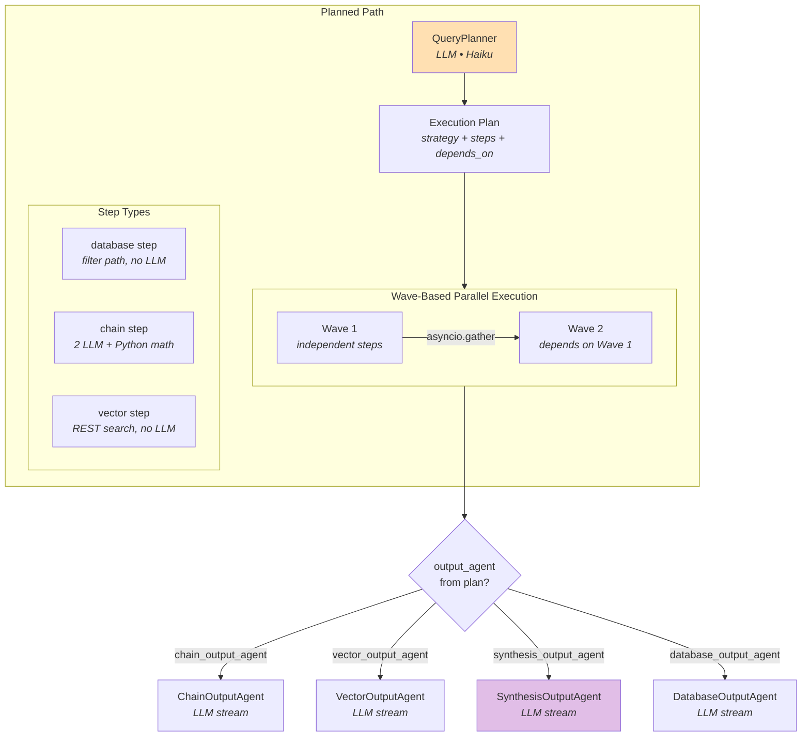

## Hybrid Device + Clinical Path

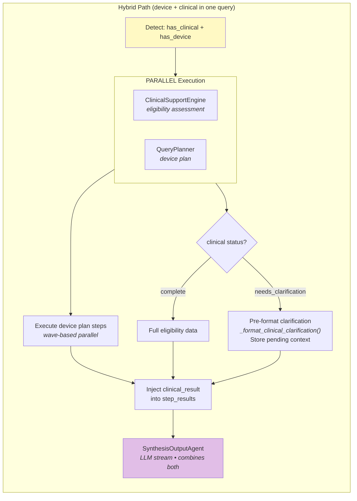

## Generic Device Pipeline

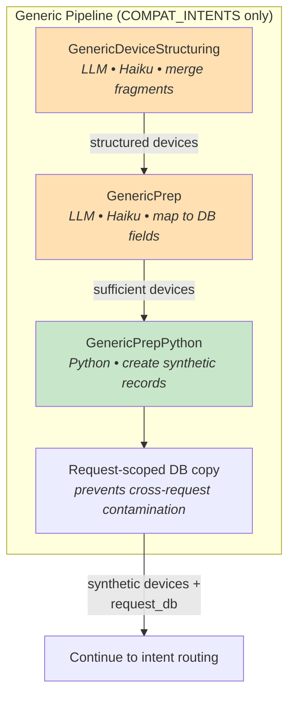

## Output Agents

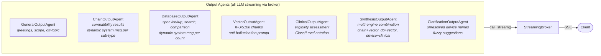

## Model Assignment

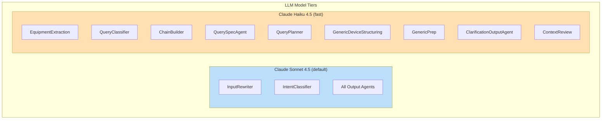

## Latency: LLM Round Trips

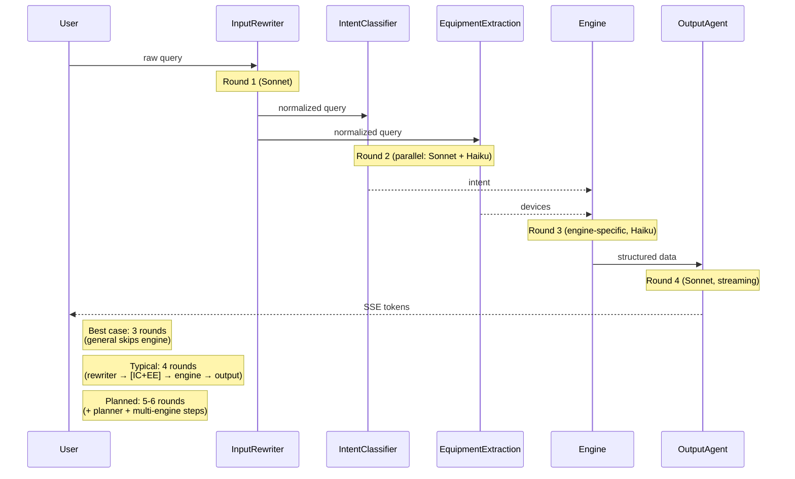

## Data Flow Contracts

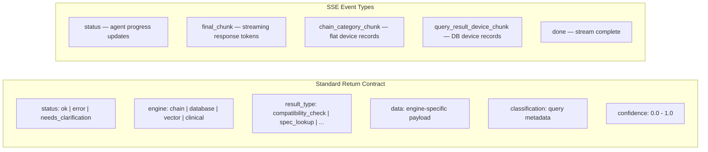

## External Dependencies

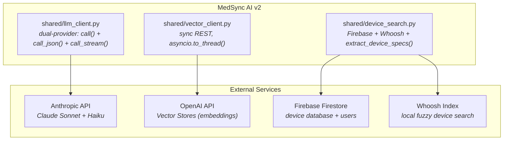
