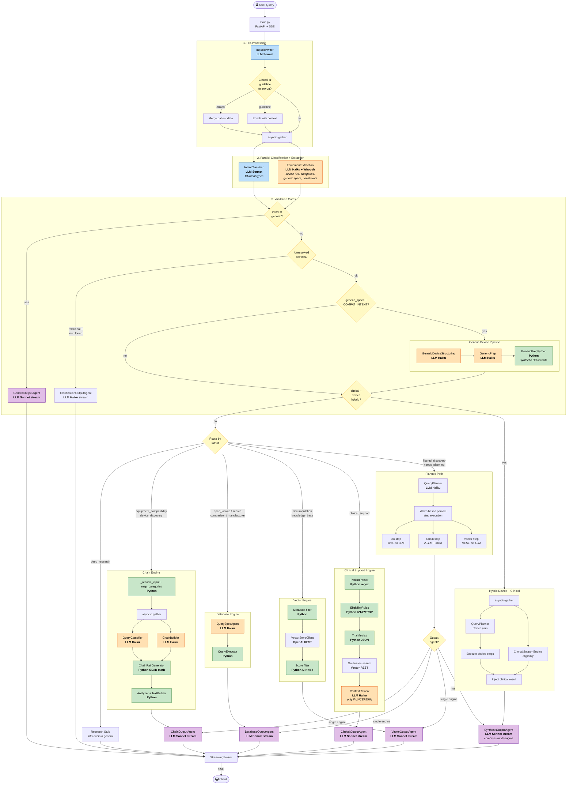

# Paste the content below (without the mermaid fences) into mermaid.live

```mermaid
flowchart TD
    USER([fa:fa-user User Query]) --> MAIN["main.py<br/>FastAPI + SSE"]
    MAIN --> S1

    %% ============ ORCHESTRATOR PRE-PROCESSING ============
    subgraph PRE["1. Pre-Processing"]
        S1["InputRewriter<br/><b>LLM Sonnet</b>"]
        FOLLOWUP{"Clinical or<br/>guideline<br/>follow-up?"}
        S1 --> FOLLOWUP
        FOLLOWUP -->|clinical| MERGE["Merge patient data"]
        FOLLOWUP -->|guideline| ENRICH["Enrich with context"]
        FOLLOWUP -->|no| PARALLEL
        MERGE --> PARALLEL
        ENRICH --> PARALLEL
    end

    subgraph PAR["2. Parallel Classification + Extraction"]
        PARALLEL["asyncio.gather"]
        IC["IntentClassifier<br/><b>LLM Sonnet</b><br/><i>13 intent types</i>"]
        EE["EquipmentExtraction<br/><b>LLM Haiku + Whoosh</b><br/><i>device IDs, categories,<br/>generic specs, constraints</i>"]
        PARALLEL --> IC & EE
    end

    IC & EE --> GATES

    %% ============ GATES ============
    subgraph GATES_BOX["3. Validation Gates"]
        GATES{"intent =<br/>general?"}
        GATES -->|yes| GEN_OUT
        GATES -->|no| VALIDATE
        VALIDATE{"Unresolved<br/>devices?"}
        VALIDATE -->|"relational +<br/>not_found"| CLARIFY_OUT
        VALIDATE -->|ok| GENERIC_GATE
        GENERIC_GATE{"generic_specs +<br/>COMPAT_INTENT?"}
        GENERIC_GATE -->|yes| GENERIC
        GENERIC_GATE -->|no| HYBRID_GATE
    end

    %% ============ GENERIC PIPELINE ============
    subgraph GENERIC["Generic Device Pipeline"]
        direction LR
        GDS["GenericDeviceStructuring<br/><b>LLM Haiku</b>"]
        GP["GenericPrep<br/><b>LLM Haiku</b>"]
        GPP["GenericPrepPython<br/><b>Python</b><br/><i>synthetic DB records</i>"]
        GDS --> GP --> GPP
    end
    GENERIC --> HYBRID_GATE

    HYBRID_GATE{"clinical +<br/>device<br/>hybrid?"}
    HYBRID_GATE -->|yes| HYBRID_PATH
    HYBRID_GATE -->|no| ROUTE

    %% ============ INTENT ROUTING ============
    ROUTE{"Route by<br/>Intent"}
    ROUTE -->|"equipment_compatibility<br/>device_discovery"| CHAIN_ENG
    ROUTE -->|"spec_lookup / search<br/>comparison / manufacturer"| DB_ENG
    ROUTE -->|"documentation<br/>knowledge_base"| VEC_ENG
    ROUTE -->|"clinical_support"| CLIN_ENG
    ROUTE -->|"filtered_discovery<br/>needs_planning"| PLANNED
    ROUTE -->|"deep_research"| RESEARCH_OUT

    %% ============ CHAIN ENGINE ============
    subgraph CHAIN_ENG["Chain Engine"]
        direction TB
        C_PREP["_resolve_input + map_categories<br/><b>Python</b>"]
        C_PAR["asyncio.gather"]
        C_QC["QueryClassifier<br/><b>LLM Haiku</b>"]
        C_CB["ChainBuilder<br/><b>LLM Haiku</b>"]
        C_MATH["ChainPairGenerator<br/><b>Python OD/ID math</b>"]
        C_ANALYZE["Analyzer + TextBuilder<br/><b>Python</b>"]
        C_PREP --> C_PAR --> C_QC & C_CB
        C_QC & C_CB --> C_MATH --> C_ANALYZE
    end
    CHAIN_ENG --> CHAIN_OUT["ChainOutputAgent<br/><b>LLM Sonnet stream</b>"]

    %% ============ DATABASE ENGINE ============
    subgraph DB_ENG["Database Engine"]
        direction TB
        DB_QSA["QuerySpecAgent<br/><b>LLM Haiku</b>"]
        DB_QE["QueryExecutor<br/><b>Python</b>"]
        DB_QSA --> DB_QE
    end
    DB_ENG --> DB_OUT["DatabaseOutputAgent<br/><b>LLM Sonnet stream</b>"]

    %% ============ VECTOR ENGINE ============
    subgraph VEC_ENG["Vector Engine"]
        direction TB
        V_META["Metadata filter<br/><b>Python</b>"]
        V_SEARCH["VectorStoreClient<br/><b>OpenAI REST</b>"]
        V_SCORE["Score filter<br/><b>Python</b> MIN=0.4"]
        V_META --> V_SEARCH --> V_SCORE
    end
    VEC_ENG --> VEC_OUT["VectorOutputAgent<br/><b>LLM Sonnet stream</b>"]

    %% ============ CLINICAL ENGINE ============
    subgraph CLIN_ENG["Clinical Support Engine"]
        direction TB
        CL_PARSE["PatientParser<br/><b>Python regex</b>"]
        CL_RULES["EligibilityRules<br/><b>Python IVT/EVT/BP</b>"]
        CL_TRIALS["TrialMetrics<br/><b>Python JSON</b>"]
        CL_VEC["Guidelines search<br/><b>Vector REST</b>"]
        CL_REVIEW["ContextReview<br/><b>LLM Haiku</b><br/><i>only if UNCERTAIN</i>"]
        CL_PARSE --> CL_RULES --> CL_TRIALS --> CL_VEC --> CL_REVIEW
    end
    CLIN_ENG --> CLIN_OUT["ClinicalOutputAgent<br/><b>LLM Sonnet stream</b>"]

    %% ============ PLANNED PATH ============
    subgraph PLANNED["Planned Path"]
        direction TB
        PL_PLAN["QueryPlanner<br/><b>LLM Haiku</b>"]
        PL_WAVES["Wave-based parallel<br/>step execution"]
        PL_DB["DB step<br/><i>filter, no LLM</i>"]
        PL_CHAIN["Chain step<br/><i>2 LLM + math</i>"]
        PL_VEC["Vector step<br/><i>REST, no LLM</i>"]
        PL_PLAN --> PL_WAVES
        PL_WAVES --> PL_DB & PL_CHAIN & PL_VEC
    end
    PLANNED --> PL_DISPATCH{"Output<br/>agent?"}
    PL_DISPATCH -->|single engine| CHAIN_OUT & DB_OUT & VEC_OUT
    PL_DISPATCH -->|multi-engine| SYNTH_OUT

    %% ============ HYBRID PATH ============
    subgraph HYBRID_PATH["Hybrid Device + Clinical"]
        direction TB
        HY_PAR["asyncio.gather"]
        HY_CLIN["ClinicalSupportEngine<br/><i>eligibility</i>"]
        HY_PLAN["QueryPlanner<br/><i>device plan</i>"]
        HY_STEPS["Execute device steps"]
        HY_INJECT["Inject clinical result"]
        HY_PAR --> HY_CLIN & HY_PLAN
        HY_PLAN --> HY_STEPS --> HY_INJECT
        HY_CLIN --> HY_INJECT
    end
    HYBRID_PATH --> SYNTH_OUT

    %% ============ OUTPUT AGENTS ============
    SYNTH_OUT["SynthesisOutputAgent<br/><b>LLM Sonnet stream</b><br/><i>combines multi-engine</i>"]
    GEN_OUT["GeneralOutputAgent<br/><b>LLM Sonnet stream</b>"]
    CLARIFY_OUT["ClarificationOutputAgent<br/><b>LLM Haiku stream</b>"]
    RESEARCH_OUT["Research Stub<br/><i>falls back to general</i>"]

    CHAIN_OUT & DB_OUT & VEC_OUT & CLIN_OUT & SYNTH_OUT & GEN_OUT & CLARIFY_OUT & RESEARCH_OUT --> BROKER

    BROKER["StreamingBroker"] -->|SSE| CLIENT([fa:fa-desktop Client])

    %% ============ STYLES ============
    classDef sonnet fill:#bbdefb,stroke:#1565c0,color:#000
    classDef haiku fill:#ffe0b2,stroke:#e65100,color:#000
    classDef python fill:#c8e6c9,stroke:#2e7d32,color:#000
    classDef output fill:#e1bee7,stroke:#6a1b9a,color:#000
    classDef gate fill:#fff9c4,stroke:#f9a825,color:#000

    class S1,IC sonnet
    class EE,C_QC,C_CB,DB_QSA,GDS,GP,CL_REVIEW haiku
    class C_PREP,C_MATH,C_ANALYZE,DB_QE,GPP,V_META,V_SCORE,CL_PARSE,CL_RULES,CL_TRIALS python
    class CHAIN_OUT,DB_OUT,VEC_OUT,CLIN_OUT,SYNTH_OUT,GEN_OUT output
    class GATES,VALIDATE,GENERIC_GATE,HYBRID_GATE,FOLLOWUP,ROUTE,PL_DISPATCH gate
```
